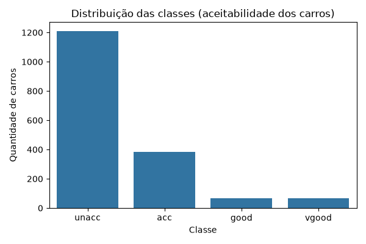
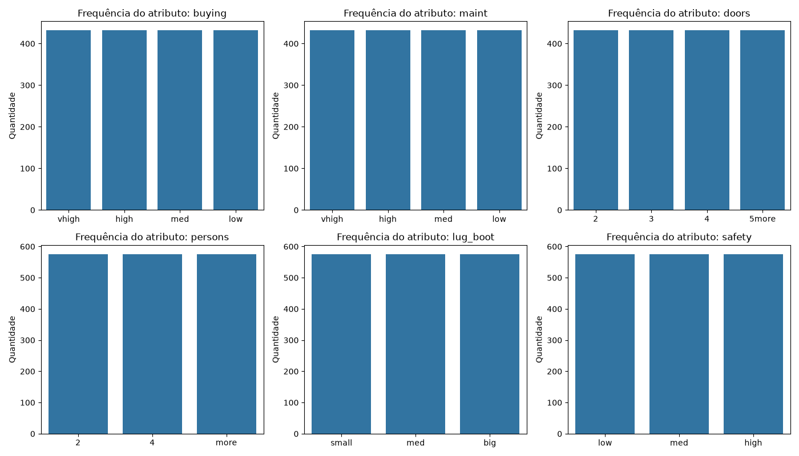
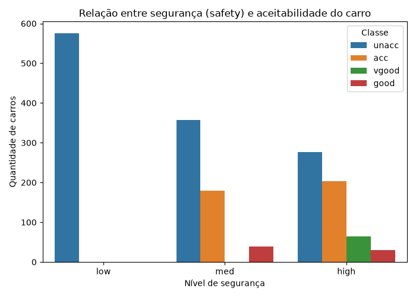
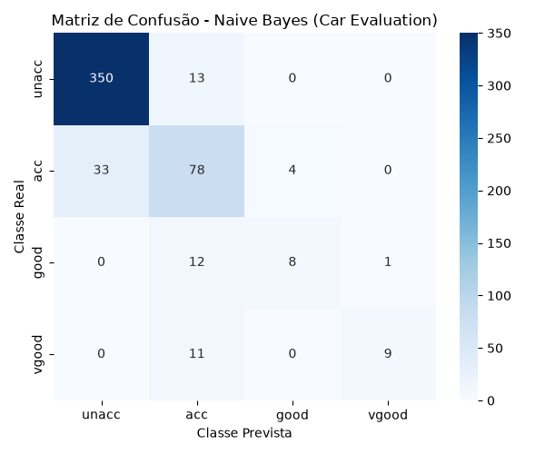

# 🚗 Car Evaluation - Classificação com Naive Bayes
## UNIVERSIDADE FEDERAL DO MARANHÃO - UFMA
## CENTRO DE CIÊNCIAS EXATAS E TECNOLOGIA - (CCET)

Projeto acadêmico de Aprendizagem de Máquina (UFMA) que aplica o algoritmo **Naive Bayes** (variante `CategoricalNB`) para prever a aceitabilidade de veículos, utilizando a base de dados **Car Evaluation** do repositório UCI Machine Learning.

**Docente:** Dr. Alex OLiveira
**Discentes:** Antonio Claudino e Daniel Lindoso
**Curso:** Engenharia da Comupaão
**Disciplina:** Inteligência Artificial 

---

## 📋 Sobre o projeto

O objetivo é classificar carros em quatro níveis de aceitabilidade (`unacc`, `acc`, `good`, `vgood`) a partir de 6 atributos categóricos (preço, manutenção, número de portas, capacidade de passageiros, porta-malas e segurança), usando o Naive Bayes — um algoritmo probabilístico simples, rápido e, apesar disso, surpreendentemente eficaz para esse tipo de problema.

O projeto foi construído seguindo o fluxo completo de um pipeline real de Machine Learning: desde o carregamento e entendimento da base, passando pela análise exploratória, pré-processamento, treinamento e avaliação do modelo.

---

## 📁 Estrutura do projeto
---

```text
car-evaluation-naive-bayes/
│
├── data/
│   ├── car.data         # Base de dados original (1728 instâncias)
│   └── car.names        # Documentação dos atributos
│
├── src/
│   ├── data_loader.py   # Carregamento e resumo inicial da base
│   ├── eda.py           # Análise exploratória (gráficos)
│   ├── preprocessing.py # Encoding ordinal + split treino/teste
│   ├── model.py         # Treinamento do CategoricalNB
│   ├── evaluation.py    # Métricas e matriz de confusão
│   └── main.py          # Executa o pipeline completo
│
├── images/              # Gráficos gerados pelo projeto
├── results/             # Métricas salvas em texto
├── requirements.txt
└── README.md
```
---
## ⚙️ Como rodar o projeto

**1. Clone o repositório:**
```bash
git clone https://github.com/daniellp-18/car-evaluation-naive-bayes.git
cd car-evaluation-naive-bayes
```

**2. Crie e ative um ambiente virtual:**
```bash
python -m venv venv
venv\Scripts\Activate.ps1   # Windows (PowerShell)
source venv/bin/activate    # Linux/Mac
```

**3. Instale as dependências:**
```bash
pip install -r requirements.txt
```

**4. Rode o pipeline completo:**
```bash
python src/main.py
```

Esse único comando executa todo o projeto de ponta a ponta: carrega os dados, gera os gráficos de análise exploratória, faz o pré-processamento, treina o modelo e avalia o desempenho — tudo automaticamente.

---

## 🧠 Sobre o algoritmo: Naive Bayes

O Naive Bayes é um classificador probabilístico baseado no **Teorema de Bayes**, com a suposição ("naive"/ingênua) de que os atributos são condicionalmente independentes entre si, dado a classe. Mesmo sendo uma simplificação, essa hipótese funciona muito bem na prática, principalmente em problemas com atributos categóricos — exatamente o caso da base Car Evaluation.

Foi utilizada a variante **`CategoricalNB`** do scikit-learn, que assume que cada atributo segue uma distribuição categórica — a escolha tecnicamente mais correta para dados como os nossos, onde todos os atributos são categorias textuais discretas (`vhigh`, `med`, `low`, etc.).

---

## 🗂️ Sobre a base de dados

A base **Car Evaluation** (UCI Machine Learning Repository) contém **1728 instâncias**, sem valores ausentes ou duplicados, descritas por 6 atributos categóricos:

| Atributo   | Significado                | Categorias                     |
|------------|-----------------------------|---------------------------------|
| `buying`   | Preço de compra              | vhigh, high, med, low          |
| `maint`    | Custo de manutenção          | vhigh, high, med, low          |
| `doors`    | Número de portas              | 2, 3, 4, 5more                  |
| `persons`  | Capacidade de passageiros    | 2, 4, more                      |
| `lug_boot` | Tamanho do porta-malas        | small, med, big                 |
| `safety`   | Segurança estimada            | low, med, high                  |

A variável alvo (`class`) classifica cada carro em: `unacc` (inaceitável), `acc` (aceitável), `good` (bom) ou `vgood` (muito bom).

📌 Fonte: [UCI Machine Learning Repository - Car Evaluation](https://archive.ics.uci.edu/dataset/19/car+evaluation)

---

## 📊 Análise Exploratória

A base é fortemente desbalanceada: 70% das instâncias pertencem à classe `unacc`, enquanto apenas 3,76% pertencem à classe `vgood`. Esse desbalanceamento se mostrou determinante para os resultados obtidos na avaliação do modelo.

**Distribuição das classes:**



**Frequência dos atributos:**



**Relação entre segurança e aceitabilidade:**



Vale destacar: quando `safety = low`, praticamente todos os carros são classificados como `unacc` — um forte indício de que a segurança é um dos atributos mais decisivos na classificação final.

---

## 🔧 Pré-processamento

Os atributos categóricos foram codificados numericamente com `OrdinalEncoder`, **respeitando a ordem real de cada categoria** (por exemplo, `buying`: low < med < high < vhigh), em vez de deixar o encoder ordenar alfabeticamente — um cuidado técnico que garante que os números codificados tenham significado de verdade.

Os dados foram divididos com a estratégia **Holdout (70% treino / 30% teste)**, com **estratificação** pela variável alvo, garantindo que a proporção entre as classes fosse mantida tanto no treino quanto no teste.

---

## 🎯 Resultados

O modelo alcançou **85,74% de acurácia geral** no conjunto de teste (519 instâncias).

**Matriz de Confusão:**



| Classe  | Precisão | Recall | F1-Score | Suporte |
|---------|----------|--------|----------|---------|
| acc     | 0.68     | 0.68   | 0.68     | 115     |
| good    | 0.67     | 0.38   | 0.48     | 21      |
| unacc   | 0.91     | 0.96   | 0.94     | 363     |
| vgood   | 0.90     | 0.45   | 0.60     | 20      |

**Principal insight:** o desempenho do modelo está diretamente relacionado à quantidade de exemplos de cada classe. A classe majoritária (`unacc`) obteve os melhores resultados, enquanto as classes minoritárias (`good` e `vgood`) apresentaram recall mais baixo — um reflexo direto do desbalanceamento identificado na análise exploratória.

---

## 💡 Discussão e possíveis melhorias

- O algoritmo `CategoricalNB` se mostrou tecnicamente adequado para este problema, dada a natureza categórica dos atributos.
- O desbalanceamento das classes foi o principal fator limitante do desempenho nas classes minoritárias.
- Como trabalhos futuros, sugerem-se: validação cruzada estratificada (Stratified K-Fold), técnicas de balanceamento de classes, e comparação com algoritmos que não assumem independência entre atributos (ex: árvores de decisão).

---

## 📚 Referências

- [Naive Bayes - scikit-learn documentation](https://scikit-learn.org/stable/modules/naive_bayes.html)
- [Car Evaluation Dataset - UCI Machine Learning Repository](https://archive.ics.uci.edu/dataset/19/car+evaluation)
- Bohanec, M. (1988). Car Evaluation [Dataset]. UCI Machine Learning Repository. https://doi.org/10.24432/C5JP48

---

## 👥 Autores

- Antonio Claudino
- Daniel Lindoso

Projeto desenvolvido para a disciplina Inteligencia Artificial — UFMA.
